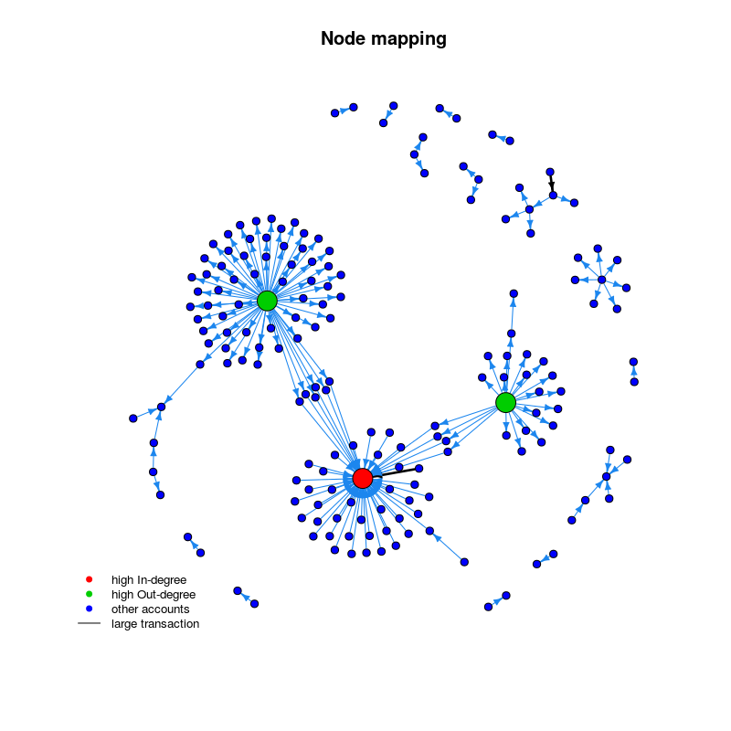

Ethr Package
================
April 2016

-   [Description](#description)
-   [Installation](#installation)
-   [Setup](#setup)
-   [Base Functions](#base-functions)
-   [Helper functions](#helper-functions)
-   [Examples](#examples)
    -   [Getting the Blockchain Data into R](#getting-the-blockchain-data-into-r)
    -   [Investigating the Data](#investigating-the-data)
    -   [Visualising the data](#visualising-the-data)

Description
===========

The 'ethr' R package is an interface for accessing Ethereum blockchain data in R, querying the Ethereum Blockchain via the JSON-RPC API.

ethr provides several convenience and helper functions, such as:

-   Handling of hexadecimal conversion
-   Access block data
-   Access transaction data/transaction receipts
-   Bulk download management

Installation
============

The package will be submitted to CRAN soon, until then you can install it from Github using devtools:

``` r
# install.packages("devtools")
devtools::install_github("BSDStudios/ethr")
```

Setup
=====

Data is extracted from your local `chaindata` folder using a running geth instance, see <https://github.com/ethereum/go-ethereum/wiki/Getting-Geth> for details.

note: ensure that you have added the `--rpc --rpccorsdomain localhost` options when initialising geth to ensure that the package can access the JSON-RPC API.

Base Functions
==============

These base functions are direct implementations of the available JSON-RPC methods detailed here, <https://github.com/ethereum/wiki/wiki/JSON-RPC> and replicate their functionality as much as possible.

-   eth\_coinbase - Returns the client coinbase address.
-   eth\_gasPrice - Returns the current price per gas in wei.
-   eth\_accounts - Returns a list of addresses owned by client.
-   eth\_blockNumber - Returns the number of most recent block.
-   eth\_getBalance - Returns the balance of the account of given address.
-   eth\_getStorageAt - Returns the value from a storage position at a given address.
-   eth\_getTransactionCount - Returns the number of transactions sent from an address at given block number.
-   eth\_gethBlockTransactionCountByHash - Returns the number of transactions in a block, given the block hash.
-   eth\_getBlockTransactionCountByNumber - Returns the number of transactions in a block the given block number.
-   eth\_getCode - Returns code at a given address.
-   eth\_getBlockByHash - Returns information about a block from a hash.
-   eth\_getBlockByNumber - Returns information about a block from the block number.
-   eth\_getTransactionByHash - Returns the information about a transaction requested by transaction hash.
-   eth\_getTransactionByBlockHashAndIndex - Returns information about a transaction by block hash and transaction index position.
-   eth\_getTransactionByBlockNumberAndIndex - Returns information about a transaction by block number and transaction index position.
-   eth\_getTransactionReceipt - Returns the receipt of a transaction by transaction hash.

Helper functions
================

These functions use the base function, queering the blockchain, but make it easier for the user to download larger chunks of data and to have more control over where those chunks are taken from.

-   getBockTransations will return a data frame of the transactions for either a given number of blocks or a specified range of blocks.

-   getBlockHeaders will return just the block header data for a given number of blocks or specified range of blocks.getBlockHeaders will return just the block header data for a given number of blocks or specified range of blocks.

-   getTransactionInTimeFrame will return the block numbers closest to two given times and dates. (This can be then input into getBockTransations to get the transactions during this time period.)

-   bulkBlockDownload.R breaks a large block range up and manages the download size. All downloaded blocks will be stored in a ethr\_blocks folder in the data\_dir.

-   getBlockRange - Returns the minimum and maximum blocks that are currently downloaded for the analysis table. Note: this does not check for continuity, only returns min and max vales.

-   nodesPlot - creates a basic node plot showing the transactions and accounts within the input data frame. Accounts with high in- or -out degree (i.e. receive or sent large number of transactions) can be highlighted and the threshold for that transaction level set. Also large transactions (more than 3x standard deviations from mean transaction value) are highlighted.

Examples
========

Getting the Blockchain Data into R
----------------------------------

Load the package using the library:

``` r
library(ethr)
```

If we want to look at the 7.00am to 7.05 am on last day of March, we can use getTransactionInTimeFrame to get the numbers of those blocks.

``` r
blocks <- getTransactionInTimePeriod("2016-03-31 07:00:00 GMT", "2016-03-31 07:05:00 GMT")
blocks
```

    ## [1] 1249240 1249265

Using getBlockTransactions will return the transaction in those. It also returns the blocks which have no transactions (the code below will remove these blocks).

``` r
transactions <- getBlockTransactions(start_block = blocks[1], end_block = blocks[2]) 
```

``` r
transactions <- transactions[complete.cases(transactions), ]
dim(transactions)
```

    ## [1] 173  21

``` r
names(transactions)
```

    ##  [1] "blNumber"           "blTimestamp"        "blTimeHash"        
    ##  [4] "blGasUsed"          "blGasLimit"         "blHash"            
    ##  [7] "blMiner"            "blDifficulty"       "blSizeBytes"       
    ## [10] "blParent"           "blReceiptRoot"      "blStateRoot"       
    ## [13] "blTransactionsRoot" "trValueEth"         "trIndex"           
    ## [16] "trGasLimit"         "trGasPriceSzabo"    "trHash"            
    ## [19] "trFrom"             "trTo"               "trNonce"

Any variables prefixed with "bl" relate to the block header while "tr" relates to the individual transactions.

If you wish to download a larger section of the blockchain, there are two options. The first option is to download the blocks in parallel.

``` r
library(foreach)
library(doParallel)

workers <- makeCluster(3)
registerDoParallel(workers)
transactions2 <- getBlockTransactions(start_block = blocks[1], end_block = blocks[2], parallel = TRUE) 
```

Another option, if you are want to access a very large chunk of the blockchain, is to use "bulkBlockDownload.R".

``` r
BulkDownload <- bulkBlockDownload(start_block = blocks[1], end_block = blocks[2], data_dir, chunk_size = 50000, parallel = TRUE, cores = 3) 
```

If only the block header data is required:

``` r
block_headers <- getBlockHeaders(start_block = blocks[1], end_block = blocks[2])
```

This gives the following information:

``` r
names(block_headers)
```

    ##  [1] "blNumber"           "blTimestamp"        "blTimeHash"        
    ##  [4] "blGasUsed"          "blGasLimit"         "blHash"            
    ##  [7] "blMiner"            "blDifficulty"       "blSizeBytes"       
    ## [10] "blParent"           "blReceiptRoot"      "blStateRoot"       
    ## [13] "blTransactionsRoot"

Investigating the Data
----------------------

To investigate a transaction further the receipt can be found using:

``` r
SingleTrans <- transactions[1,]$trHash
receipt <- eth_getTransactionReceipt(SingleTrans)
receipt
```

    ## $blockHash
    ## [1] "0x993e75e6443b608bf2b50f24c911141463c2099447d99e4c6e66457e9f51e2b6"
    ## 
    ## $blockNumber
    ## [1] "0x130fd8"
    ## 
    ## $contractAddress
    ## NULL
    ## 
    ## $cumulativeGasUsed
    ## [1] "0x5208"
    ## 
    ## $from
    ## [1] "0x2a65aca4d5fc5b5c859090a6c34d164135398226"
    ## 
    ## $gasUsed
    ## [1] "0x5208"
    ## 
    ## $logs
    ## list()
    ## 
    ## $to
    ## [1] "0x122a865ece094d39060b064436fb8823b29bbb06"
    ## 
    ## $transactionHash
    ## [1] "0x90f30b198068f8c9f557c1024f81ea1f0caca49577100cb8f611b34c12d01305"
    ## 
    ## $transactionIndex
    ## [1] "0x0"

Here the gas used is for that single transaction. This, and other hex values, can be converted using

``` r
hexDec(receipt$gasUsed)
```

    ## 1 'mpfr' number of precision  16   bits 
    ## [1] 21000

This will return a 'mpfr' value. Use as.numeric to covert into a more useful value. However larger numbers (such as when dealing with wei values), the as.numeric may reduce precision, though this can be manually set.

There is also a 'decHex' to convert from decimal to hex. This may be needed in for example 'eth\_getBalance' which requires the block number in hex format. Please check the documentation for input formats.

Investigating a block can be done using either the block hash or the block number.

``` r
blockNum  <- transactions[49, ]$blNumber
blockHash <- transactions[49, ]$blHash
eth_getBlockByNumber(decHex(blockNum), full_list = FALSE)
eth_getBlockByHash(blockHash, full_list = FALSE)          
```

Visualising the data
--------------------

The function 'nodesPlot' is a preliminary function which allows the user to visualize the nodes and transactions using igraph. The function asks for a threshold, which relates to the number of transactions sent of received by an account (i.e., the in- or -out degree). Any accounts above this threshold are then highlighted on the plot. Also transactions which are greater than 3x the standard deviation of the value of the transactions are highlighted (darker arrows). (Note: this function works better in Rstudio than on command line. If on command line, un-comment "x11()" on line 82.)

``` r
nodesPlot(table = transactions, degree_thres = 20, save_plot = TRUE)
```


